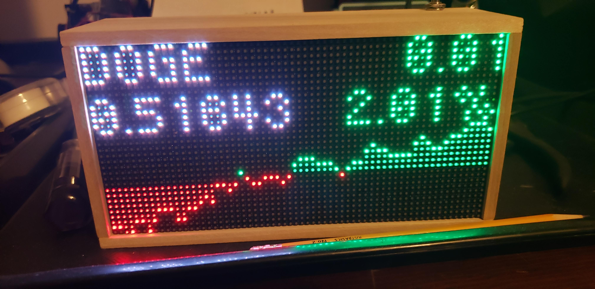
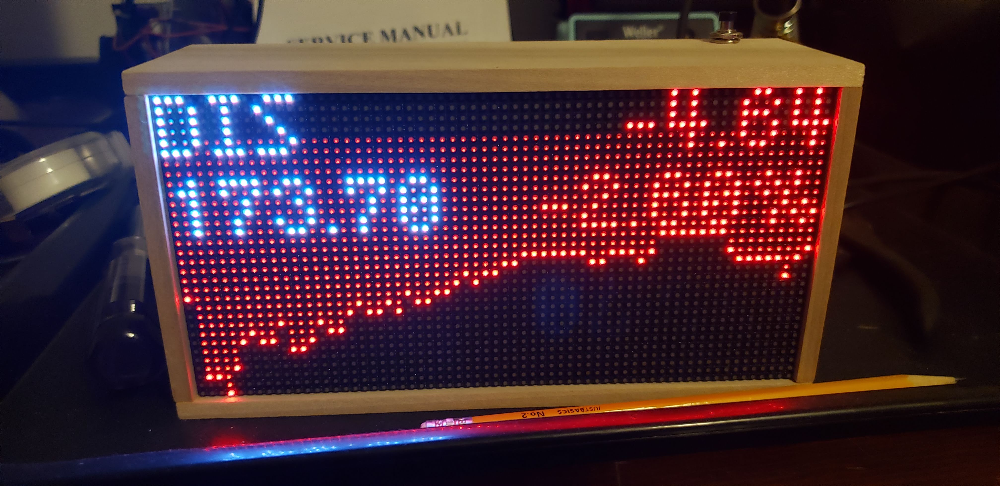
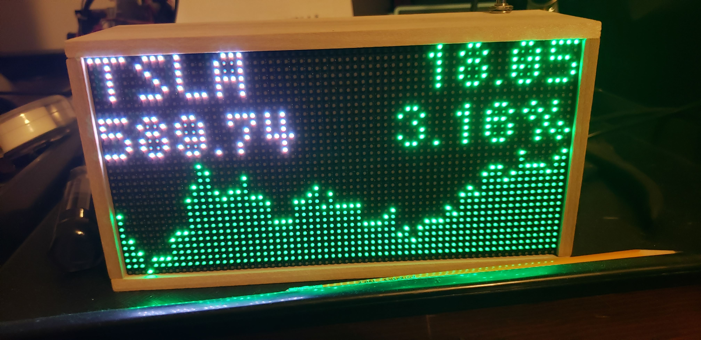

# stonks
This is a stocks board for the [nhl-led-scoreboard](https://github.com/riffnshred/nhl-led-scoreboard) project. It will fetch and display single day stock price information for a list of tickers. It will display the single day dollar change and percent change, and an intraday price chart. The display assumes a 64x32 LED matrix. See Configuration for details.

</img>
</img>
</img>

## Installing
To use this new board, you will need to make some edits to 3 files within the [nhl-led-scoreboard](https://github.com/riffnshred/nhl-led-scoreboard) source.

1. Place the `stonks.py` file in the `nhl-led-scoreboard/src/boards` directory
2. Add the following two lines to the bottom of `nhl-led-scoreboard/src/boards.py`:
```
    def stonks(self, data, matrix, sleepEvent):
        Stonks(data, matrix, sleepEvent)
```
Ensure you have the leading spacing correct, because python.

3. Update `nhl-led-scoreboard/config/config.schema.json` so that it will allow `stonks` as a valid board. Simply add `"stonks"` to the json blob `"definitions" \ "boards_list" \ "enum"`. This is near the top of the file, roughly between lines 18 and 30.

4. Add the following 5 lines to `nhl-led-scoreboard/src/data/scoreboard_config.py`:
```
        # Stonks
        self.stonks_tickers = json["boards"]["stonks"]["tickers"]
        self.stonks_rotation_rate = json["boards"]["stonks"]["rotation_rate"]
        self.stonks_logo_enabled = json["boards"]["stonks"]["logo_enabled"]
        self.stonks_chart_enabled = json["boards"]["stonks"]["chart_enabled"]
```
These lines ensure that the configuration data for the `stonks` board is read and made available to the code. I added them around line 140, just after the config section for "Clock".

## Configuration
Within the `boards` section of the `config.json` file, you will need a section for `stonks`:
```
        "stonks": {
            "tickers": [
                "DOGE-USD","MMM","TSLA", "BTC-USD", "AAPL", "AMD", "DIS"
            ],
            "rotation_rate": 6,
            "chart_enabled": true
            "logo_enabled": false,
        },
```
When you add the `"stonks"` section to the config file, make sure you have that last comma!

Now you can add the `stonks` board to any of the game states in your config!

### tickers
A list of stock symbols, using the Yahoo Finance symbology. Basically, look up the stocks you want to use on Yahoo Finance and then cut and paste the tickers here.

### rotation_rate
How long, in seconds, each stock stays on the display before switching to the next stock. The total display time for the stocks will be the number of stocks in `tickers` multiplied by the `rotation_rate`

### chart_enabled
A boolean value that determines whether a chart will be displayed. If this is `false`, then the data fetch for chart data will not occur.

### logo_enabled (Not Implemented)
A boolean value that determines whether to display the ticker (i.e. company) logo.

### Other Configuration Options
The display assumes you are using a 64x32 LED matrix. You can tweak this (untested!) by adjusting the `LED_WIDTH` and `LED_HEIGHT` values in the source file. 

## Requirements
The [nhl-led-scoreboard](https://github.com/riffnshred/nhl-led-scoreboard) project has been synced to your pi.

The [yfinance](https://github.com/ranaroussi/yfinance) python package must be installed. This can be achieved by running `pip3 install yfinance`. Since `yfinance` depends on 
`numpy` and `pandas`, you may need to ensure they are up to date as well. This can be achieved by running `pip3 install yfinance --upgrade`.
